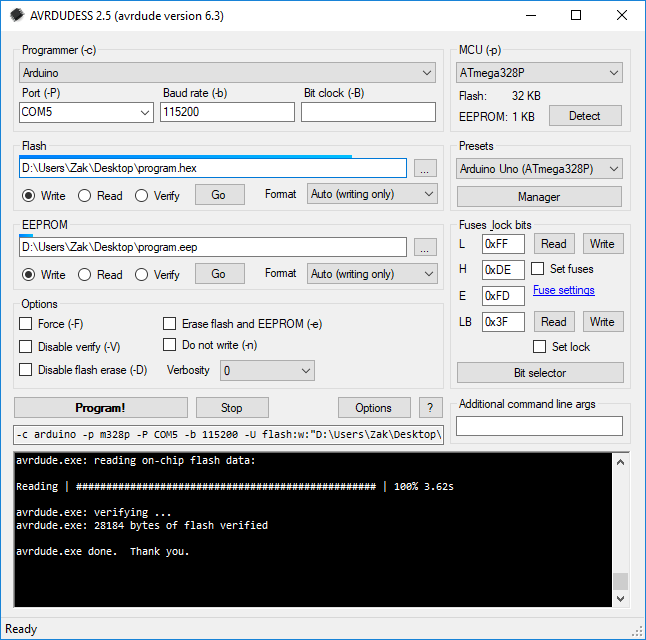

# AVRDUDESS - A GUI for AVRDUDE

This is a GUI for AVRDUDE ([https://github.com/avrdudes/avrdude/](https://github.com/avrdudes/avrdude/)).

[https://blog.zakkemble.net/avrdudess-a-gui-for-avrdude/](https://blog.zakkemble.net/avrdudess-a-gui-for-avrdude/)

## Windows:

Requires .NET Framework 2.0 SP1 or later. All systems since Windows Vista will have the required version already installed.

## Linux & macOS:

Can be ran using Mono ([http://www.mono-project.com](http://www.mono-project.com)).\
Has not been tested on macOS, but should work. Might need the `--arch=32` argument.

    mono --arch=32 avrdudess.exe

## Installing on Ubuntu 18.04 and later:

Install Mono (this is the minimum required, you can use `mono-complete` for a full install):

    sudo apt install libmono-system-windows-forms4.0-cil

On older versions of Ubuntu you might need to use `libmono-winforms2.0-cil` instead.

Install AVRDUDE and AVR Binutils (for avr-size):

    sudo apt install avrdude binutils-avr

Run AVRDUDESS with Mono, you might have to run as root (sudo) so that AVRDUDE can access ports if you haven't changed any permissions or rules.d stuff:

    mono avrdudess.exe

## Building:

You will need Microsoft Visual Studio 2015 or later installed (older might work too). Open `./src/avrdudess.sln` and click the 'Start' button at the top and it will build and run AVRDUDESS.\
You can find the output in `./src/avrdudess/bin/Debug/`, or `./src/avrdudess/bin/Release/` if you chose to build for Release (the drop down box second from the left of the Start button is where you can choose the configuration).

## Making the Installer:

You will need [Inno Setup](https://www.jrsoftware.org/isinfo.php) installed. Once you've used Visual Studio to build the Release version of AVRDUDESS, run `./installer/installer.bat` and the installer exe will appear in the same directory.
